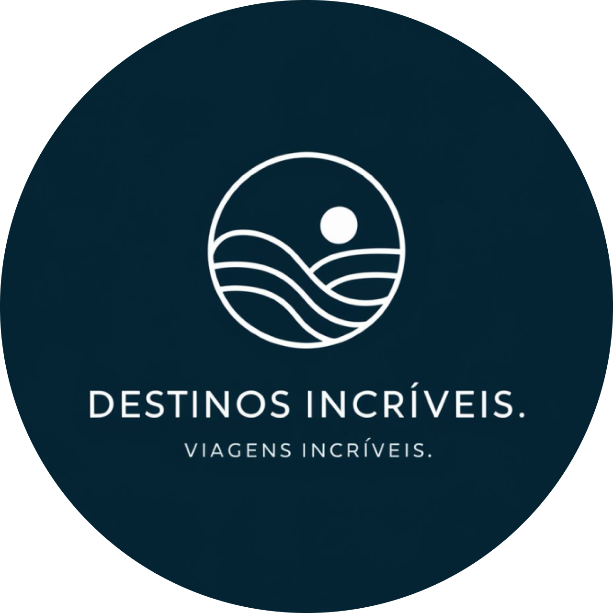
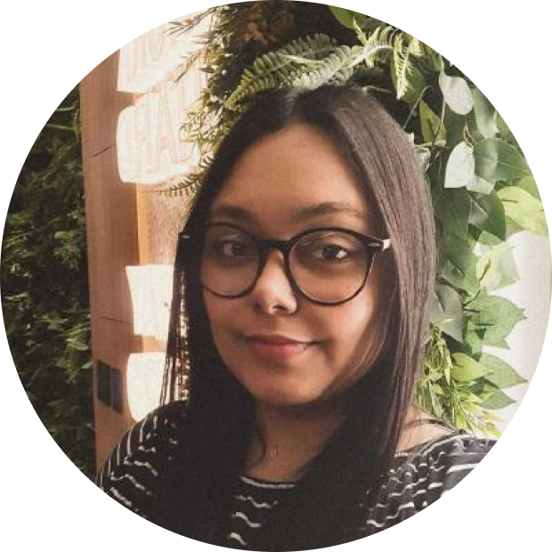
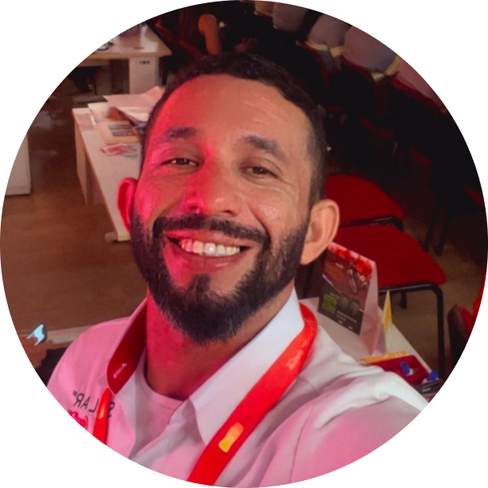
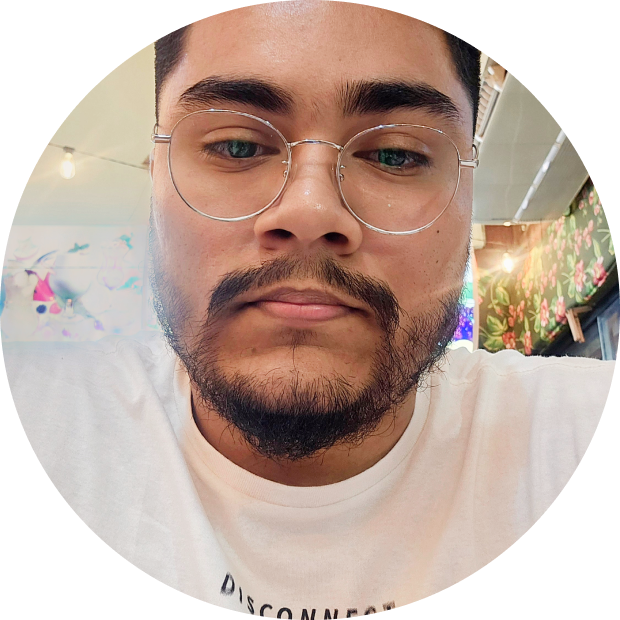

<p align="center">
  
  
</p>

# <p align="center">Destinos Incríveis</p>

## Sobre
Nosso objetivo é proporcionar aos clientes uma plataforma de viagens que ofereça mais liberdade e opções de escolha no mercado. A inspiração para este projeto surgiu após um incidente envolvendo uma empresa conhecida do setor, que suspendeu pacotes previamente vendidos, causando frustração e desconfiança entre os consumidores. Com isso em mente, estamos comprometidos em mostrar que somos uma empresa séria e confiável, dedicada a não decepcionar nossos clientes, garantindo que suas expectativas sejam atendidas com transparência e responsabilidade.

## Layout
Disponível no [Figma](https://www.figma.com/design/Ao87X101ymlK1gSCh9yVBu/Grupo-3---Design-Agencia-Viagens?node-id=4-4&node-type=canvas&t=1OQPB5WyikXkJ7VI-0).

## Tecnologias
[](https://skillicons.dev)

## Executar o projeto
Clone o repositório:
```
git clone https://github.com/vianabsouza/destinos-incriveis.git
```

Navegue até ao diretório correto:
```
cd destinos-incriveis
```

Abra o arquivo ```index.html``` no seu navegador para visualizar o site.

## Deploy
Disponível na Vercel: [Destinos Incríveis](https://destinos-incriveis.vercel.app/).

## Autores
<table>
  <tr>
    <td align="center"><a href=""><br /><sub style="color: #1251B5"><b>Barbara Viana</b></sub></a><br /></td>
    <td align="center"><a href=""><br /><sub style="color: #1251B5"><b>Breno Barros</b></sub></a><br /></td>
    <td align="center"><a href=""><br /><sub style="color: #1251B5"><b>David Reis</b></sub></a><br /></td>
  </tr>
  <tr>
    <td align="center"><a href=""><br /><sub style="color: #1251B5"><b>Galdino Júnior</b></sub></a><br /></td>
    <td align="center"><a href="https://github.com/hallyssonmateus"><br /><sub style="color: #1251B5"><b>Hallysson Mateus</b></sub></a><br /></td>
    <td align="center"><a href="https://github.com/JonasSatiro"><br /><sub style="color: #1251B5"><b>Jonas Sátiro</b></sub></a><br /></td>
  </tr>
</table>